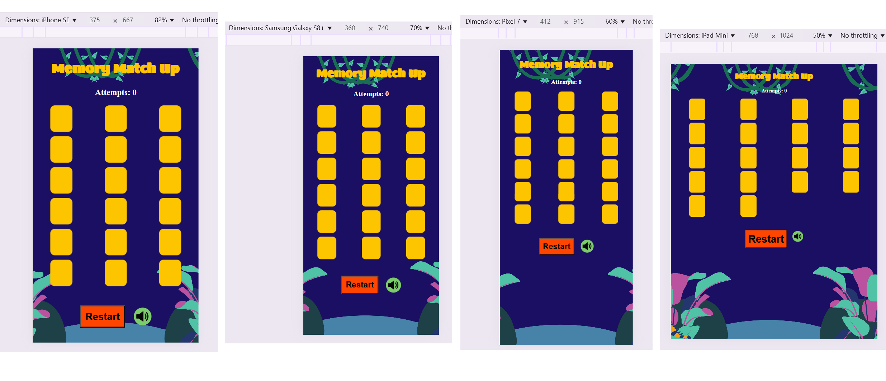
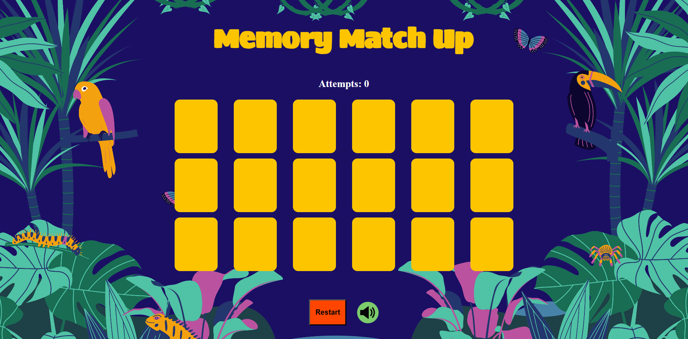
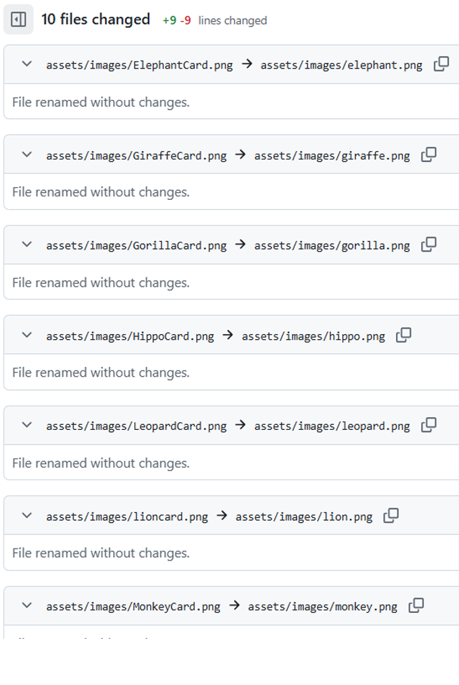
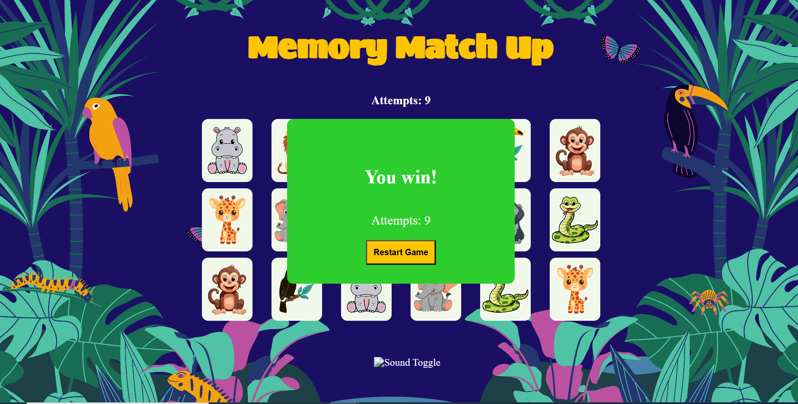
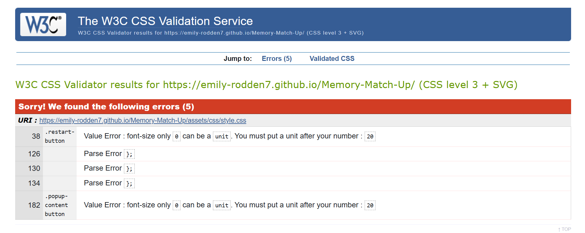
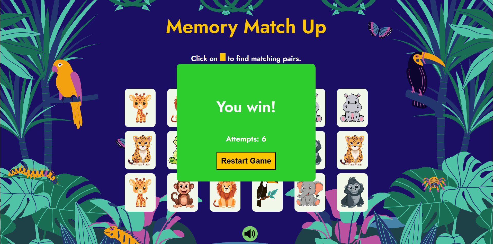

 # My Second Milestone Project
## Title: Memory Match Up

[View the live project here.](https://emily-rodden7.github.io/Memory-Match-Up/)

I have created a seperate folder called [README-data](README-data), which contains extra information and screenshots to show the progress of the game.

## User Experience UX

### User stories

I wanted to create a game aimed at younger children. I used to love playing pairs when I was younger so I wanted to make an online version to help children improve their memory, but also have fun. 

#### First time visiting the page

First time visiting the game, I want it to be easy to understand and be able to start playing straight away. 

I want it to be visually appealing and get the players talking about the game to encourage more people to visit the site and play. 

#### People returning to play the game

I would like players to keep coming back to the page to try and beat their last score. 

#### End goals of the game

Have different levels of difficulty and have the options to share the scores with friends, and compete head to head. 

### Design

I have decided to go with a jungle theme, and have cartoon style background and animal images on the face cards.

#### Research

I first went online to see what kind of memory games have already been created. See links below for the sites I visited:

- [Helpful Games](https://www.helpfulgames.com/subjects/brain-training/memory.html)

- [Web Games Online](https://www.webgamesonline.com/memory/)

- [Pairs One](https://pairs.one/en)

#### Colour Scheme

I wanted to pick colours that stood out from the background and could still connect with the jungle theme. They yellow is a colour that pairs very well with navy, so having that as the main font colour mean it'll easily stand out.

The brown and green stick with the jungle theme, and I ended up changing from the yellow game restart button to a orange/red colour to make it stand out from the cards and show it as a high importance button, to not click it accidently.

- Heading colour: #fdc500
- Restart game button colour: rgb(255, 69, 0)
- Hover button colour: #675513
- Popup background colour: rgb(45, 205, 45)

#### Font Types

I used google fonts for the text and headings on the page.

[Google Fonts](https://fonts.google.com/) was used for the headings in this game.

- Main font: [Jost](https://fonts.google.com/specimen/Jost?preview.text=Memory%20Match%20Up)

- Secondary font (backup font): sans-serif

#### Imagery

##### Background

I have used Canva to get my background image. After spending time researching different images available on Canva, I decide to use this jungle theme, that was created by Canva Creative Studio: 

##### Picture Cards

I got the animal images from [Canva Graphics](https://www.canva.com/features/free-stock-photos/) and added them onto a white background and exported them as PNG into VS Code.

#### Sound

I wanted sound for when the player managed to get a match of two cards. I ended up choosing a 'chime' sound.

I also wanted a final sound to indicate the game was over, the player has won. I decided on an applause sound, as you usually get an applause at the end of something happening.

These sounds I exported from [Canva](https://www.canva.com/en_gb/help/stock-music/) as an MP4, I then imported them into Premier Pro to export as a MP3 file.

#### Project Goals

My goal is to help improve a childs memory while also enjoying a memory game. I would like the game to grow and develope to eventually be able to attract a wider target audience, with different diffculity and options for different designs. 

### Wireframes

## Features

- Responsive on all devices, including desktop. laptop, tablet and mobile.

- Game is fully interactive, all cards have a 3d effect when clicked to turn them around.

- Sound applied to a successful match of cards, and sound for when the game is won at the end.

- Popup menu including the number of attempts it took to complete the game and the option to restart the game and play again.

## Technologies Used

### Language Used

- [HTML5](https://en.wikipedia.org/wiki/HTML5)
- [CSS3](https://en.wikipedia.org/wiki/Cascading_Style_Sheets)
- [JavaScript](https://simple.wikipedia.org/wiki/JavaScript)

### Bugs

- The first bug I encountered was the images/ cards wouldn't load onto the screen. I had the below error appear when I inspected the site on Google Chrome. It appeared for all images I was using for the cards. After talking with Code Institute Tutors, we console.log parts of the code to figurue out what worked and didn't, we eventually reformatted and removed one of the hidden backface-visibility: hidden; 

## Further Testing

- The game was tested on Google Chrome, Internet Explorer, Microsoft Edge and Safari browsers.

- The game has been viewed and played on different devices including, Desktop, Laptop, iPhoneSE and Samsung Galaxy S8+, Pixel 7, iPad Mini (I have used Google Chrome, right clicked with the mouse, clicked inspect and tried different dimensions to make sure the game worked). 

### Testing all code works

- I tested to make sure the button hover works; that the button changes colour when the mouse hovers over it and that the curser changes to a pointer. 

- I tested the 3d flip of the cards when they get clicked, as well as the curser changing to a pointer when hovering over the cards. The screenshot below is of the card while in the middle of turning around. 

- Sound works when getting a match and when the game finishes and the popup menu appears.

- I tested the sound button. When clicked while on, it turns to off. When clicked while off, it turns to on. The image also changes and the curser changes to a pointer. 

- I tested the attempts code. The number increased when I didn't get a match and stayed the same when I did get a match. 

### Final preview of site

Below is the final game site screenshot before launching.

### Market Research

I showed the game to my family and friends to get their opinions and views. After gathering all information I ended up making a few changes to the game, mostly visual changes: 

- Changing the 'Errors:' at the top to 'Attempts', because my research suggested people thought it could be a problem with the game, or something didn't load properly. They recommended I use a different word. Before image: 

- Changing the Restart Button from a yellow colour (same as the cards) to the current orange/red (rgb(255, 69, 0)) colour. This was because the feedback I had was younger children might accidentally click the restart button instead of a card if they aren't paying 100% attention. Before image: 
Following this feedback, I decided to also move both the Restart Button and the Sound Button futher down, to give more of a gab between the cards and these buttons.

- Although the players that tested the game could read the heading, they recommended I use a different, slightly clearer font type. I ended up changing the font from ['Sigmar'](https://fonts.google.com/specimen/Sigmar) to ['Jost'](https://fonts.google.com/specimen/Jost?preview.text=Memory%20Match%20Up)

Screenshot of the game once all market research changes have been made:

## Deployment

After deploying the game, I found a couple of error came up. The images on the cards didn't show up, instead when you clicked on a card it turned the card around and then had the name of the image file, not the image. To fix this I changed the file names, amde sure there were no capitals in the file name and imported them back into VS Code. After commiting and syncing the site with the deployed site; the pictures now load. Although the screenshot only shows some of the files, I changed all the animal image files.

The sound also stopped working when deploying the site; I have removed the sound files, renamed the files and the references to the sound in the code. I then imported the sound back into the code, made sure all teh code is correct with the new file names without capitals and deployed again. 

The sound image would fail to load after clicking on it to mute the sound. I removed the files from VS Code, changed the names of the files and imported them back in and editing the code to include the new file name. I also changed the JavaScript Toggle Sound, as the if statement code was the wrong way around for when the sound should be on or off.

## After Deployment Testing

The W3C Markup Validator and W3C CSS Validator Services were used to validate the game and the page itself to ensure there were no syntax errors in the project.

-  [W3C Markup Validator](https://jigsaw.w3.org/css-validator/#validate_by_input) :  - I fixed the errors and ran the test again. 
- 

### Final game screenshot

 

### GitHub Pages

Memory-Match-Up was deployed to GitHub Pages.

1. Log in to GitHub and locate the [GitHub Repository](https://github.com/)
2. At the top of the Repository (not top of page), locate the "Settings" Button on the menu.
3. On the settings page, scroll down until you locate the "GitHub Pages" Section.
4. Under "Source", click the dropdown called "None" and select "Deploy from brand" and "main".
5. Wait and then refresh the page.
6. Go back to the code tab and on the right hand side, shows deployments.
7. Click on deployments and selete te top deployed link. This takes you to the game site.

## Next Stage

After launching this first version of the game; I would like to continue to work on it to improve and add more features to encounrage players to keep coming back to the game.

- I'd like to add in a first flip of the cards. You can see them all for a few seconds as soon as the page loads and then it disappears.
- I'd like to add in different levels of difficulty, easy, medium and hard. These would have more or less cards to match up depending on difficulty and how similar the cards are to each other to make it harder to see the differences.

## Credits

All content was written by developer; with the help of the videos from Code Institute Level 5 Diploma in Web Application Development.

I also watched videos on YouTube from people that have created the same game as me. Some code was taken and then formatted to work with my game:

- [Code Craft Studio](https://www.youtube.com/watch?v=03KwZ7Sph2M)
- [JavaScript Academy](https://www.youtube.com/watch?v=xWdkt6KSirw)
- [Developedbyed](https://www.youtube.com/watch?v=-tlb4tv4mC4)

### Media

#### Images

The images I got from [Canva](https://www.canva.com/en_gb/), they have royalty-free images to use on any designs. This is where I got all the animal images and the background image on the game.

- Background created by [Canva Creative Studio](https://www.canva.com/p/canvacreativestudio/)

#### Sound

I also got the sound from [Canva](https://www.canva.com/en_gb/), they have royalty-free sounds that goes off when the player matches two cards and the applause that's played when the game is won.